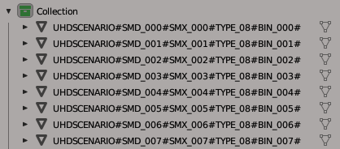

# RE4-UHD-SCENARIO-SMD-TOOL
Extract and repack RE4 UHD scenario smd file

**Translate from Portuguese Brazil**

Programa destinado a extrair e recompactar os cenários usando somente um arquivo .OBJ;

## Tutorial
Veja abaixo tutoriais em português de como usar a tool:
 [RE4 UHD Tutorial Editando Scenarios SMD](https://jaderlink.blogspot.com/2023/11/RE4-UHD-TUTORIAL-SCENARIO-SMD.html)
 [RE4 UHD Tutorial Editando r100.SMD](https://jaderlink.blogspot.com/2023/11/RE4-UHD-TUTORIAL-R100-SMD.html)

## Update: B.1.0.0.5
Corrigido bug no qual o arquivo MTL com PACK_ID com IDs que continham letras, as letras não eram consideradas.

## Update: B.1.0.0.4
Corrido erro, ao ter material sem a textura principal "map_Kd", será preenchido como Pack ID00000000 e texture ID 000;
  Agora, caso a quantidade de vértices for superior ao limite do arquivo, o programa vai avisar. (Não será criado o arquivo SMD);

## Update B.1.0.0.3
Corrigido bug que deformava a malha do modelo 3d, estava sendo criado faces do tipo "quad" de maneira errada; 

## Update B.1.0.0.2

Adicionado compatibilidade com outros editores 3D que não suportam caracteres especiais #: como, por exemplo, o 3dsMax;
  Adicionado também uma verificação no nome dos grupos, então caso esteja errado o nome, o programa avisa-rá;
  Os arquivos da versão anterior são compatíveis com essa versão;

## Update B.1.0.0.1

* Adicionado suporte para o **R100**, agora você pode extrair esse cenario dividido em 7 SMD, em um único arquivo .obj, use "R100.r100extract"; (Veja mais formações mais abaixo);
* Adicionado verificação do "magic" do arquivo .Smd;
* Nos arquivos ".idxuhdscenario" e ".idxuhdsmd" adicionados os campos "Magic" e "ExtraParameterAmount", no qual só vão aparecer caso forem usados.
* O "Magic" padrão é o 0x0040;
* Corrigido a extração do campo "vertexColors", no arquivo .obj;
* Os arquivos da versão anterior são compatíveis com essa versão.

## RE4_UHD_SCENARIO_SMD_TOOL.exe

Programa destinado a extrair e reempacotar os arquivos de cenario .SMD do re4 Uhd;

## Extract:

Use o bat: "RE4_UHD_SCENARIO_SMD_TOOL Extract all scenario SMD.bat"
 Nesse exemplo vou usar o arquivo: r204_04.SMD
 Ao extrair será gerado os arquivos:

* r204_04.scenario.idxuhdscenario  // arquivo importante de configurações, para o repack usando o .obj;
* r204_04.scenario.idxuhdsmd //  arquivo importante de configurações, para o repack usando os arquivos .bin;
* r204_04.scenario.obj // conteúdo de todo o cenário, esse é o arquivo que você vai editar;
* r204_04.scenario.mtl // arquivo que acompanha o .obj;
* r204_04.scenario.idxmaterial // conteúdo dos materiais (alternativa ao uso do .mtl);
* r204_04.scenario.idxuhdtpl // representa o arquivo .tpl, presente no .smd;
* r204_04\ //pasta contendo os arquivos .bin e o .tpl;

## Repack:

Existem duas maneiras de fazer o repack.

* usando o arquivo .idxuhdscenario, o repack será feito usando o arquivo .obj;
* usando o arquivo .idxuhdsmd, o repack será feito com os arquivos .bin da pasta "r204_04";

## Repack com .idxuhdscenario

Use o bat: "RE4_UHD_SCENARIO_SMD_TOOL Repack all with idxuhdscenario.bat"
 Nesse exemplo vou usar o arquivo: "r204_04.scenario.idxuhdscenario"
  que vai requisitar os arquivos:
* r204_04.scenario.obj (obrigatório)
* r204_04.scenario.mtl OU r204_04.scenario.idxmaterial + r204_04.scenario.idxuhdtpl

  Ao fazer o repack será gerado os arquivos:
* r204_04.SMD (esse é o arquivo para ser colocado no .udas);
* r204_04.scenario.Repack.idxmaterial
* r204_04.scenario.Repack.idxuhdtpl
* r204_04.scenario.Repack.idxuhdsmd
* r204_04\ //pasta contendo os novos arquivos .bin e o novo .tpl; (aviso: ele sobrescreve os arquivos);

## Repack com .idxuhdsmd

Use o bat: "RE4_UHD_SCENARIO_SMD_TOOL Repack all with idxuhdsmd.bat"
 Nesse exemplo vou usar o arquivo: "r204_04.scenario.idxuhdsmd"
  que vai requisitar os arquivos:
 -- os arquivos .bin e .tpl da pasta "r204_04";

Ao fazer o repack será gerado os arquivos:
 -- r204_04.SMD (esse é o arquivo para ser colocado no .udas);

Nota: esse é o método antigo, no qual se edita os bin individualmente, porem o repack com .idxuhdscenario cria novos bin modificados, e um novo .idxuhdsmd, no qual pode ser usado para fazer esse repack; essa opção é para caso você queira colocar um .bin no .smd que o programa não consiga criar.

## Sobre r204_04.scenario.obj

Esse arquivo é onde está todo o cenário, nele os arquivos BIN são separados por grupos, no qual é nomenclatura deve ser respeitada:
  Exemplo:
  UHDSCENARIO#SMD_000#SMX_000#TYPE_08#BIN_000#
  UHDSCENARIO#SMD_001#SMX_001#TYPE_08#BIN_001#

Sendo:
* É obrigatório o nome do grupo começar com "UHDSCENARIO", e ser divido por #
* A ordem dos campos não pode ser mudada;
* SMD_000 esse é o ID do da posição da Entry/Line no .SMD, a numeração é em decimal
* SMX_000 esse é o ID do SMX, veja o arquivo .SMX,  a numeração é em decimal
* TYPE_08 esse não sei oque é, a numeração é em hexadecimal.
* BIN_000 esse é o id do bin que será usado, para bin repetidos, será considerado somente o primeiro, (o próximo com o mesmo id, será usado o mesmo modelo que do primeiro).
* o nome do grupo deve terminar com # (pois depois de salvo o arquivo, o blender coloca mais texto no final do nome do grupo)

----> No Update B.1.0.0.2, o nome dos objetos/grupos também pode ser:
  UHDSCENARIO\_SMD\_000\_SMX\_000\_TYPE\_08\_BIN\_000\_
  UHDSCENARIO\_SMD\_001\_SMX\_001\_TYPE\_08\_BIN\_001\_

----> Sobre verificações de grupos:
  * No Repack se ao lado direito do nome do grupo aparecer o texto "The group name is wrong;", significa que o nome do grupo está errado, e o seu arquivo SMD vai ficar errado;
  * E se ao lado direito aparecer "Warning: Group not used;" esse grupo esta sendo ignorado pelo meu programa, caso, na verdade, você gostaria de usá-lo, você deve arrumar o nome do grupo;

**Editando o arquivo .obj no Blender**
 No importador de .obj marque a caixa "Split By Group" que esta no lado direto da tela.
 Com o arquivo importado, cada objeto representa um arquivo .BIN
 
 Nota: caso você tenha problema com texturas transparente ficando pretas use esse plugin: (**[link](https://github.com/JADERLINK/Blender_Transparency_Fix_Plugin)**) 

**Ao salvar o arquivo**
 Marque as caixas "Triangulated Mesh" e "Object Groups" e "Colors".
  no arquivo .obj o nome dos grupos vão ficar com "_Mesh" no final do nome (por isso no editor termina o nome do grupo com # para evitar problemas)

## Sobre .idxuhdscenario / .idxuhdsmd
Segue a baixo a lista de comando mais importantes presente no arquivo:

* SmdAmount:106 // representa a quantidade de Entry/Line no .Smd (você pode mudar, mas em alguns cenário pode esta crashando o jogo)
* SmdFileName:r204_04.SMD // esse é o nome do arquivo Smd que será gerado
* BinFolder:r204_04 // esse é o nome da pasta onde sara salvo/esta os arquivos .bin e o .tpl;
UseIdxMaterial:false // caso ativado será o usado o arquivo .idxmaterial ao invez do .mtl para fazer o repack (campo somente no idxuhdscenario);
* EnableVertexColor:false // se ativado cria os bins com o campo de "Vertex Color", mas o .obj não tem um suporte adequado para isso (campo somente no idxuhdscenario);
BinAmount:106 // quantidade de arquivos bins que serão colocados no .smd (campo somente no idxuhdsmd);
* os outros comandos que começam com números são autodescritivos (o número é o ID do Smd)
* o campo "_position*" é divido por 100, em relação ao valor original;
* o campo "_objectStatus" refere-se o campo "TYPE" no .obj;

# sobre .idxmaterial e .idxuhdtpl
Veja sobre em [RE4-UHD-BIN-TOOL](https://github.com/JADERLINK/RE4-UHD-BIN-TOOL);

# sobre .r100extract e r100extract
Para extrair o cenário coloque os arquivos .Smd necessários ao lado de .r100extract;
  Nota: no topico **tutorial** tem um tutorial sobre como editar o r100;

## Código de terceiro:

[ObjLoader by chrisjansson](https://github.com/chrisjansson/ObjLoader):
Encontra-se no RE4_UHD_SCENARIO_SMD_TOOL, código modificado, as modificações podem ser vistas aqui: [link](https://github.com/JADERLINK/ObjLoader).

**At.te: JADERLINK**
 2024-01-20
